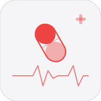

# Dose

Personal substance tracker, harm reduction wiki, and health dashboard.

## Features
- Dose logging with journal, filters, search
- 200+ substance wiki with harm reduction data
- Drug interaction checker against active stack
- Tolerance tracking with washout period alerts
- Daily health check-ins and biometrics
- Usage heatmap, frequency stats, insights
- CSV export, fully offline (localStorage)

## Run
```bash
npm install && npm run dev   # localhost:5173
npm test
npm run build
vercel --prod
```

## Roadmap
- [ ] Reset login credentials to jatrommel@gmail.com (store the new password in Keychain, never in the repo)
- [ ] Add a forgot-password / reset-password flow
- [ ] Propagate the forgot-password flow to every app in the codebase that has login or registration
- [ ] Custom substance creation
- [ ] Mood and sleep correlation with Apple Health sync
- [ ] OCR pill identification
- [ ] Lab PDF parsing — import bloodwork PDFs, parse values, flag out-of-range
- [ ] iOS companion app — log doses, view active stack, interaction warnings natively
- [ ] Reflexology and breathing modules (expansion from harm reduction into general wellness)
- [ ] Declutter UI — reduce visual noise, simplify navigation
- [ ] Claude/Apple Liquid Glass redesign (backdrop-filter blur, -apple-system font, #0071e3)
- [ ] Vibe clone portfolio aesthetic
- [ ] Multi-profile support — create profiles, transfer personal data between them
- [ ] Move Supabase anon key out of source — `ios/Services/AuthService.swift:6` has it hardcoded, move to `Info.plist`

## Changelog
v1.3.0
- Portfolio vibe: Geist font, flat monochrome palette, spring animations, no shadows.

v1.1.0
- Added dose logging with journal, filters, and search.
- Built the substance wiki with harm reduction data and interaction checking.
- Shipped health check-ins, biometrics, insights, and offline CSV export.

## License
MIT 2026 Joshua Trommel
