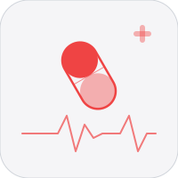
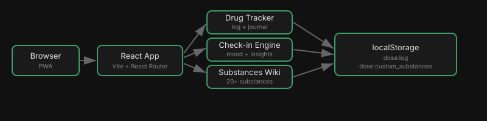

# Healstack
  [](https://github.com/nulljosh/healstack)

**Live:** https://healstack.heyitsmejosh.com

Know what you took, when, and what it does with everything else you're on.

A dose log, a harm reduction library, and a health dashboard. Web, iOS and macOS. Your data stays on your device.


## Screenshots


<p>


</p>

## Features
- Log a dose in two taps. Journal, filter, search.
- 200 substances with harm reduction notes, written by hand.
- Interaction warnings against your active stack, before you log.
- Tolerance tracking with washout alerts.
- Daily check-ins and biometrics.
- Heatmap, frequency, insights.
- Lab results, in and out of range.
- CSV export. Works offline.

## Run
```bash
npm install && npm run dev   # localhost:5173
npm test
npm run build
./deploy.sh                  # Cloudflare Pages
```

Native apps live in `ios/` and `macos/`. Each has an xcodegen `project.yml`.

## Docs
- [Technical whitepaper](WHITEPAPER.md)
- [API and agent tools](docs/API.md). HTTP surface plus the WebMCP tools on `document.modelContext`.
- [Roadmap](roadmap.md)

## Architecture



## License
MIT 2026 Joshua Trommel
