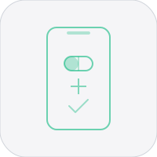

# Dose


iOS health tracker for supplements, medications, and biometrics.

## Features

- 200+ built-in substances with interaction checking
- HealthKit integration (HR, HRV, SpO2, sleep, steps, weight, BP)
- Dose reminders, home screen widget, daily check-ins
- Swipe-to-delete history, search, backdate with timestamp picker
- CSV export, biometric tracking

## Run

```bash
xcodegen generate && open Dose.xcodeproj
```

Requires Xcode 16+, iOS 17+. Deploy via Xcode to device or TestFlight.

## Roadmap

- [ ] Charts/trends for dose frequency and biometric correlations
- [ ] iCloud sync via CloudKit or SwiftData migration
- [ ] Custom substances and notes, watchOS companion, and Siri Shortcuts/App Intents

## Changelog

### v2.1.0

- Added 200+ built-in substances with interaction checking
- Integrated HealthKit metrics for HR, HRV, SpO2, sleep, steps, weight, and BP
- Built dose reminders, a home screen widget, daily check-ins, and CSV/biometric tracking

## License

MIT 2026 Joshua Trommel
